# Presence System

A Spring Boot backend for managing users, instructors, students,
courses, lessons and attendance data storage tracking.

---

## Features

- User Authentication and Roles (Admin, User, Student, Instructor)
- Instructor and Lesson Management atm
- Secure Password Storage with BCrypt
- Auditable Entities with Creation and Modification Timestamps
- RESTful API Endpoints for CRUD Operations
- Database seeding for testing and development (users and lessons atm)

---

## API Endpoints (✅ / ❌)

- `POST /api/users` - Register a new user ✅
  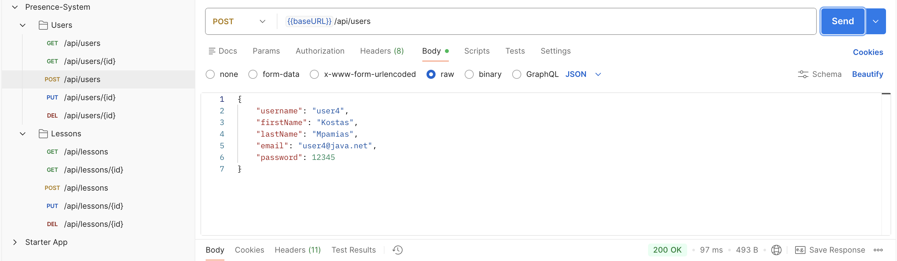
- `GET /api/users/{id}` - Get user details by ID ✅
  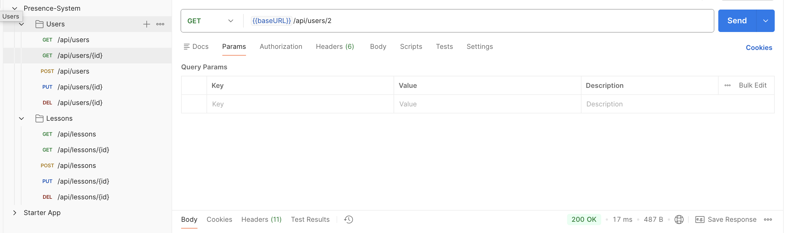
- `GET /api/users` - Get all users ✅
  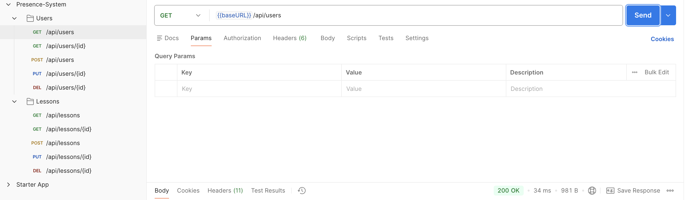
- `PUT /api/users/{id}` - Update user details ✅
  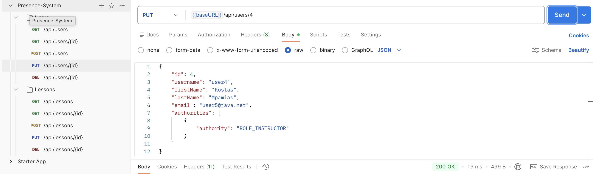
- `DELETE /api/users/{id}` - Delete user by ID ✅
  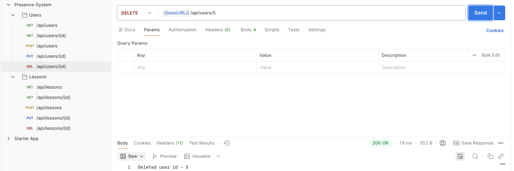
- `POST /api/lessons` - Create a new lesson ✅
  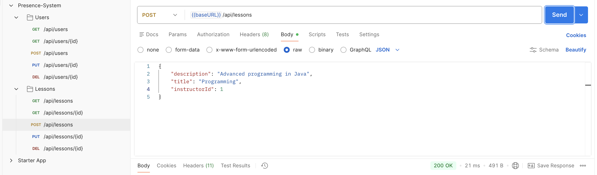
- `GET /api/lessons/{id}` - Get lesson details by ID ✅
  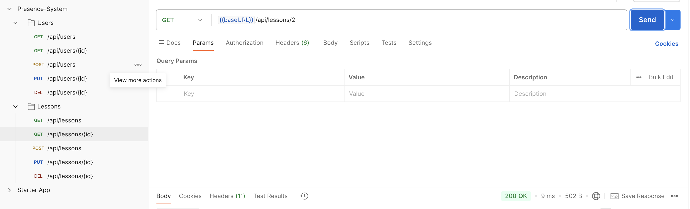
- `GET /api/lessons` - Get all lessons ✅
  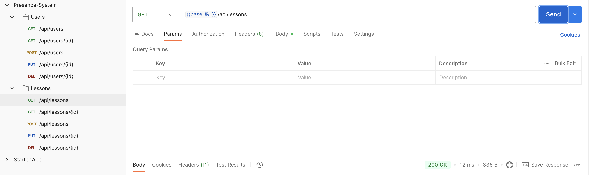
- `PUT /api/lessons/{id}` - Update lesson details ✅
  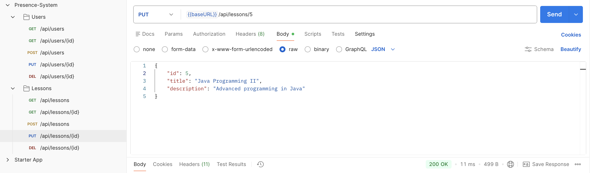
- `DELETE /api/lessons/{id}` - Delete lesson by ID ✅
  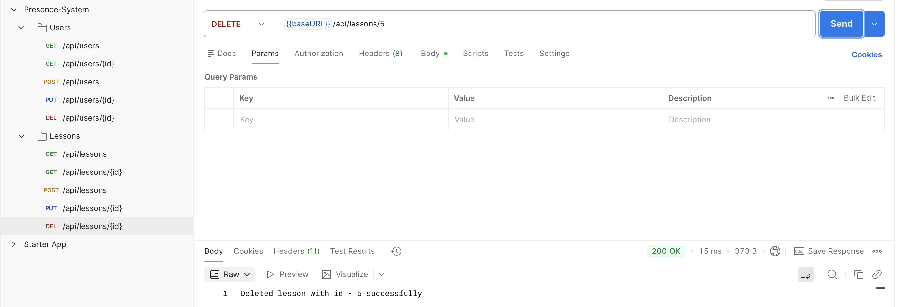
- `GET /api/classrooms` - Get all classrooms ✅
  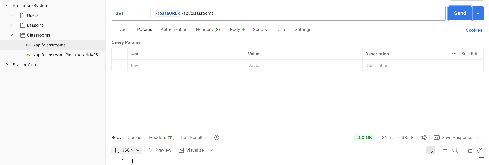
- `POST /api/classrooms` - Create a new classroom ✅
  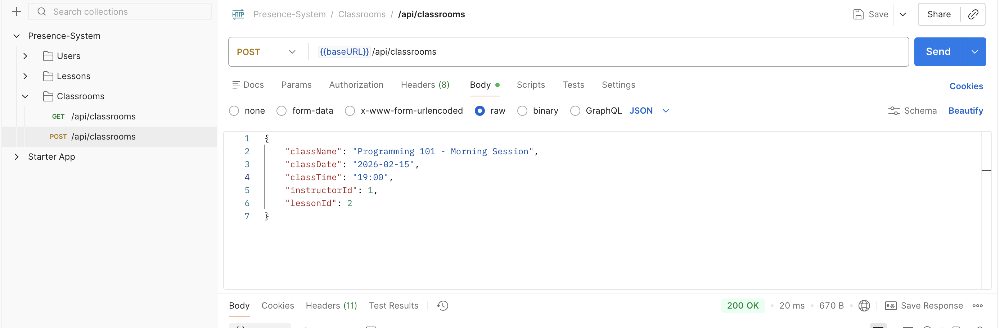
- `GET /api/classrooms/{id}` - Get classroom details by ID - work in progress ❌

> Note: More endpoints for Instructors, Students, Courses, and Attendance will be added in future updates.

---

## Seeding Test Data

- The database is seeded on startup for a fresh/empty database:
    - Admin, Student (not yet - ❌), Instructor, User accounts
    - Sample Lessons
    - (See `DataSeeder.java` and seeding classes for details)

---

## Author

**Georgios Adamidis**  
🌍 Kos, Greece  
👨‍💻 Java, Spring Boot developer  

 